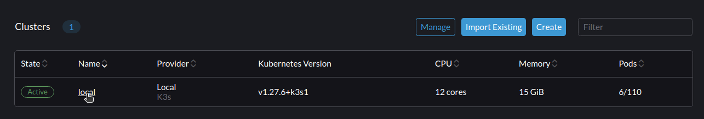
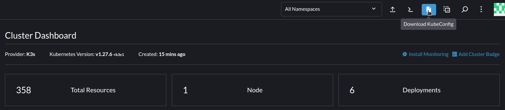
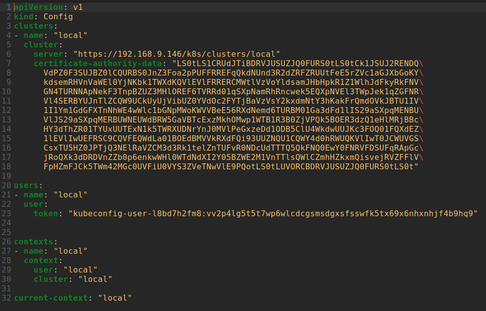
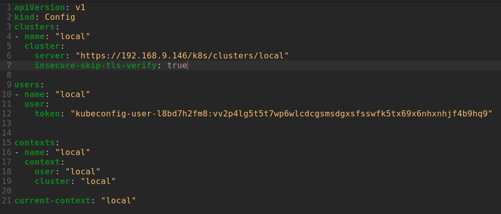

# Minikube
## Quick start (From [Rancher](../Rancher/README.md))
To see how to start rancher,
1. Select your cluster


2. Download the KubeConfig


3. Preview of the KubeConfig


4. Remove the certificate-autority-data and add insecure-skip-tls-verify: true


5. CD to home directory and create a new directory called .kube
```sh
cd ~
mkdir .kube
```

6. Move the KubeConfig to the .kube directory
```sh
mv Downloads/kubeconfig.yaml .kube/config
```

7. Export the KubeConfig
```sh
export KUBECONFIG=~/.kube/config
```

8. Quick check to see if the KubeConfig is working

| Items to check                      | Command                                                                                          |
| ----------------------------------- | ------------------------------------------------------------------------------------------------ |
| KubeConfig                          | ```kubectl config view ```                                                                       |
| nodes                               | ```kubectl get nodes ```                                                                         |
| namespaces                          | ```kubectl get namespaces ```                                                                    |
| pods                                | ```kubectl get pods --all-namespaces ```<br>```kubectl get pods -n <NAMESPACE> ```               |
| watching pods                       | ```watch kubectl get pods --all-namespaces ```<br>```kubectl get pods -n <NAMESPACE> -w```       |
| containers                          | ```kubectl get pods --all-namespaces -o jsonpath='{.items[*].spec.containers[*].name}' ```       |
| containers from specified namespace | ```kubectl get pods -o jsonpath='{.spec.containers[*].name}' -n <NAMESPACE> ```                  |
| services                            | ```kubectl get services --all-namespaces ```<br>```kubectl get services -n <NAMESPACE> ```       |
| deployments                         | ```kubectl get deployments --all-namespaces ```<br>```kubectl get deployments -n <NAMESPACE> ``` |
| statefulsets                        | ```kubectl get statefulsets --all-namespaces ```                                                 |
| configmaps                          | ```kubectl get configmaps --all-namespaces ```                                                   |
| secrets                             | ```kubectl get secrets --all-namespaces ```                                                      |
| replicasets                         | ```kubectl get replicasets --all-namespaces ```                                                  |

9. Other items to check

| Items to check            | Command                                                       |
| ------------------------- | ------------------------------------------------------------- |
| daemonsets                | ```kubectl get daemonsets --all-namespaces ```                |
| jobs                      | ```kubectl get jobs --all-namespaces ```                      |
| cronjobs                  | ```kubectl get cronjobs --all-namespaces ```                  |
| persistentvolumeclaims    | ```kubectl get persistentvolumeclaims --all-namespaces ```    |
| persistentvolumes         | ```kubectl get persistentvolumes --all-namespaces ```         |
| storageclasses            | ```kubectl get storageclasses --all-namespaces ```            |
| roles                     | ```kubectl get roles --all-namespaces ```                     |
| rolebindings              | ```kubectl get rolebindings --all-namespaces ```              |
| clusterroles              | ```kubectl get clusterroles --all-namespaces ```              |
| clusterrolebindings       | ```kubectl get clusterrolebindings --all-namespaces ```       |
| serviceaccounts           | ```kubectl get serviceaccounts --all-namespaces ```           |
| ingresses                 | ```kubectl get ingresses --all-namespaces ```                 |
| networkpolicies           | ```kubectl get networkpolicies --all-namespaces ```           |
| limitranges               | ```kubectl get limitranges --all-namespaces ```               |
| resourcequotas            | ```kubectl get resourcequotas --all-namespaces ```            |
| horizontalpodautoscalers  | ```kubectl get horizontalpodautoscalers --all-namespaces ```  |
| poddisruptionbudgets      | ```kubectl get poddisruptionbudgets --all-namespaces ```      |
| priorityclasses           | ```kubectl get priorityclasses --all-namespaces ```           |
| customresourcedefinitions | ```kubectl get customresourcedefinitions --all-namespaces ``` |
| apiservices               | ```kubectl get apiservices --all-namespaces ```               |
| controllerrevisions       | ```kubectl get controllerrevisions --all-namespaces ```       |
| csidrivers                | ```kubectl get csidrivers --all-namespaces ```                |
| csinodes                  | ```kubectl get csinodes --all-namespaces ```                  |
| endpointslices            | ```kubectl get endpointslices --all-namespaces ```            |
| events                    | ```kubectl get events --all-namespaces ```                    |
| leases                    | ```kubectl get leases --all-namespaces ```                    |
| localsubjectaccessreviews | ```kubectl get localsubjectaccessreviews --all-namespaces ``` |
| podsecuritypolicies       | ```kubectl get podsecuritypolicies --all-namespaces ```       |
| storageclasses            | ```kubectl get storageclasses --all-namespaces ```            |

## Creating a new namespace and pod
1. Create a new namespace
```sh
kubectl create namespace test
```

2. Create a new pod
```sh
kubectl run nginx --image=nginx --restart=Never -n test
```

3. Expose the pod
```sh
kubectl expose pod nginx --port=80 --type=NodePort -n test
```

4. Check the pod
```sh
kubectl get pods -n test
```

## Accessing the pod
1. Get the IP of the pod
```sh
kubectl get pods -n test -o wide
```

2. Get the IP of the minikube
```sh
minikube ip
```

3. Access the pod
```sh
curl <MINIKUBE_IP>:<NODE_PORT>
```

## Deleting a namespace and pod
1. Delete the pod
```sh
kubectl delete pod nginx -n test
```

2. Delete the namespace
```sh
kubectl delete namespace test
```
