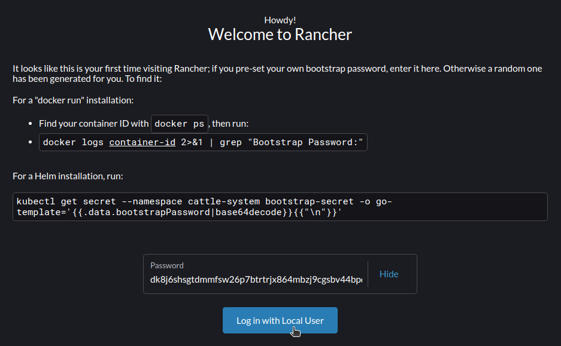
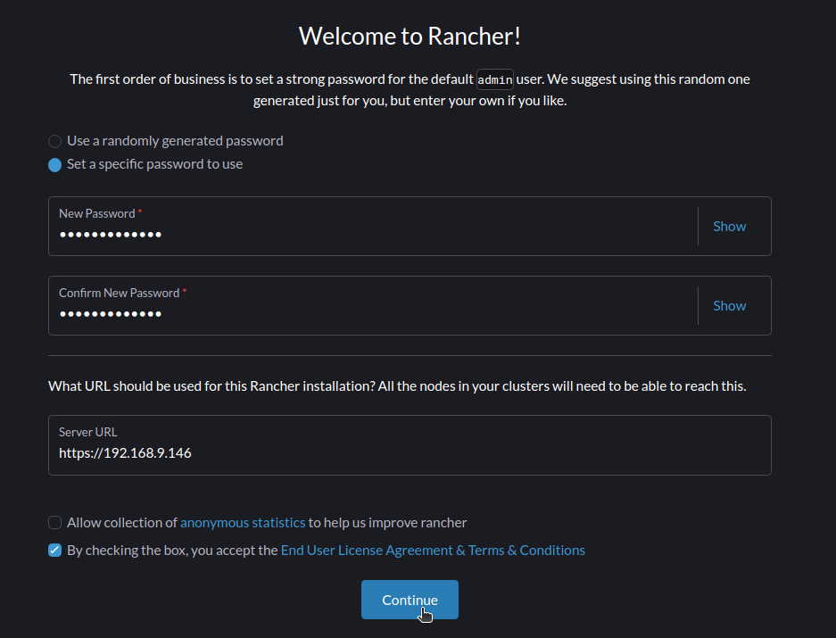
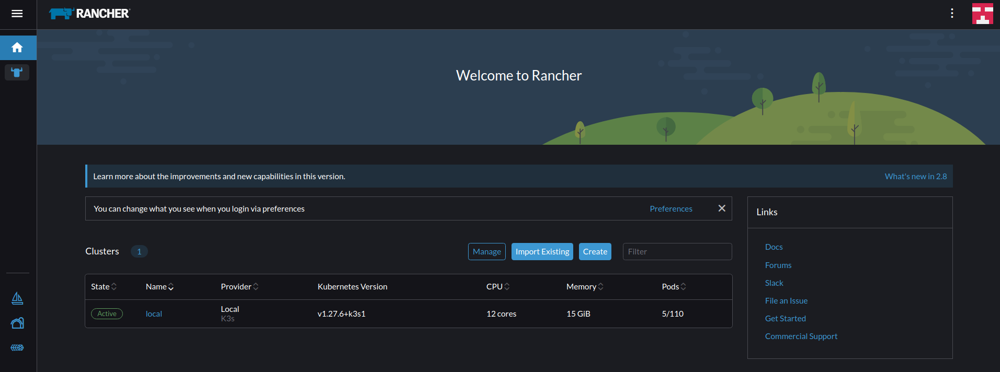

# Rancher

## Quickstart (Using Docker)
1. Docker run command
```
docker run --privileged --name my-rancher -d -p 80:80 -p 443:443 rancher/rancher
```
2. Get your ip address
```
ip addr | grep noprefix | grep -oP 'inet \K\S+' | cut -d'/' -f1
```
3. Browse to your ip address in any browser

4. Grep the generated password
```sh
docker logs <CONTAINER-ID-OR-NAME> 2>&1 | grep "Bootstrap Password:"
# docker logs my-rancher 2>&1 | grep "Bootstrap Password:"
# 2024/03/14 03:14:57 [INFO] Bootstrap Password: dk8j6shsgtdmmfsw26p7btrtrjx864mbzj9cgsbv44bpd6hp2rqvch
```
5. Login to the rancher server using the generated password


6. Set the password


7. Setup is completed


8. Continue with [minikube setup](../Minikube/README.md)

9. Stopping rancher container
```sh
docker stop my-rancher
```

10. Restarting rancher container
```sh
docker start my-rancher
# Need to wait for quite a bit and then browse back the your ip address
```